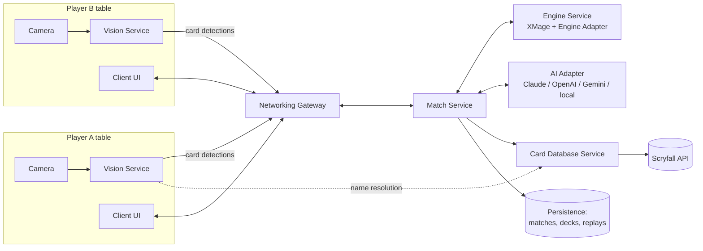

# Architecture Overview

Magic Mock is a platform for playing Magic: The Gathering with **physical cards**
while a synchronized **digital game state** enforces the rules for every player —
including AI opponents.

## System context

## The one invariant

**Only the rules engine mutates game state.** Every actor — human UI, vision
pipeline, LLM agent — submits _action proposals_; the engine validates and applies
them (ADR-0004). The ordered log of validated actions is simultaneously:

- the **synchronization primitive** (clients replay the log to converge),
- the **replay format**,
- the **audit trail** for disputed physical-board states.

## Modules

| Module                                                   | Responsibility                                                                                                          | Explicitly NOT responsible for                                                     |
| -------------------------------------------------------- | ----------------------------------------------------------------------------------------------------------------------- | ---------------------------------------------------------------------------------- |
| **Engine Service** (JVM)                                 | Embeds XMage behind the platform-owned Engine Adapter API: create game, list legal actions, propose action, state views | UI, card metadata, networking                                                      |
| **Card Database** (`packages/card-database`)             | Card metadata via Scryfall: exact/fuzzy name resolution, id lookup, search, caching                                     | Game logic, legality _enforcement_                                                 |
| **Vision Service** (Python, planned)                     | Detect and recognize physical cards, track board state, calibration, confidence handling                                | Any game logic; low-confidence detections become user confirmations, never guesses |
| **Match Service** (planned)                              | Match lifecycle, seats, spectators, action-log fan-out, reconnection                                                    | Rules decisions                                                                    |
| **Networking Gateway** (planned)                         | WebSocket sessions, auth, backpressure, LAN and online topologies                                                       | Game and match semantics                                                           |
| **AI Adapter** (planned)                                 | Provider-agnostic LLM interface; agents that pick among engine-supplied legal actions                                   | State mutation (impossible by design)                                              |
| **Deck Manager / Replay / Auth / Persistence** (planned) | Deck CRUD + legality via card DB; replay from action logs; identity; storage                                            | —                                                                                  |

## Key decisions (ADR index)

1. [ADR-0001](adr/0001-adopt-xmage-as-rules-engine.md) — Adopt **XMage** (MIT,
   client-server, 31k+ cards) as the rules engine, behind an anti-corruption layer.
2. [ADR-0002](adr/0002-scryfall-as-card-data-source.md) — **Scryfall** exclusively
   for card data; never for game logic.
3. [ADR-0003](adr/0003-monorepo-and-language-strategy.md) — Monorepo; TypeScript
   services/clients, JVM engine service, Python vision service.
4. [ADR-0004](adr/0004-ai-proposes-engine-validates.md) — AI/vision **propose**,
   engine **validates**; single mutation path.

## Scalability posture

- Match Service and Gateway are stateless per-connection; game state lives in the
  Engine Service keyed by match id → horizontal scaling by sharding matches across
  engine instances (a match is the atomic unit; no cross-match state).
- Action logs are append-only and small → cheap persistence, cheap spectator/replay
  fan-out.
- Card data is cache-first with bulk-data import planned, so Scryfall is not in any
  latency-critical path.
- Vision runs client-side (player's device) so server cost is independent of camera
  count.

## Physical-card loop (the product's core flow)

1. Camera frames → vision service detects a card event (e.g., new card on battlefield).
2. Vision resolves the card via fuzzy name lookup (card database) and attaches a
   confidence score.
3. High confidence → action proposal to the match service; low confidence → the
   player's UI asks for confirmation.
4. Engine validates ("can Lightning Bolt legally be cast now by seat 2?").
   Legal → applied + broadcast; illegal → the player is told why (their physical
   board now disagrees with the game — exactly the situation a judge resolves in
   paper play).
